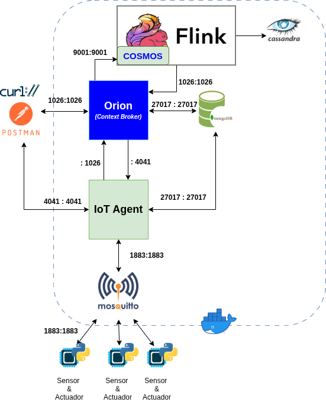

# Introducción
El objetivo de esta actividad es que el alumno conecte FIWARE con Apache Flink, procese el flujo de datos generado por FIWARE para obtener nuevos datos y guarde tanto los datos recibidos como los calculados en una BB.DD. Cassandra para su posterior análisis. Además, en función de los datos recibidos se modificará la información de contexto de FIWARE desde Apache Flink.

# Descripción de la actividad
El ejercicio es una evolución de la actividad en la que se simuló el envío de las telemetrías por un coche de F1, y la implementación de un controlador de DRS que activaba y desactivaba el DRS del coche en función de los valores de la velocidad y el freno del coche.

El envío de las telemetrías de coche es emulado por el *script* de Python proporcionado en `scripts/f1_car_mqtt.py` que envía utilizando MQTT y UltraLight 2.0 los datos de telemetría según las siguientes claves:

* 'd' = 'distance'
* 's' = 'speed'
* 't' = 'throttle' 
* 'b' = 'break'
* 'g' = 'gear'
* 'r' = 'rpm'

Por ello, en Fiware, se deberá dar de alta un dispositivo que tenga como atributos los anteriormente indicados, y un comando `drs` que pueda tomar el valor `ON` u `OFF` según se active o no el DRS del coche. La activación del DRS se realizará de forma remota a través del proceso que se ejecutará en Apache Flink. 

Los datos del coche se redireccionarán a Apache Flink, que calculará la aceleración y el estado del DRS, los guardará en una BB.DD. Cassandra, para su posterior procesamiento, y comunicará si es necesario el estado del DRS al coche.

## Arquitectura del sistema.
La arquitectura del sistema se puede ver en la [Figura 1](#fig-fiware-flink-cassandra).

<a name="fig-fiware-flink-cassandra">

<figure>
    
    <figcaption style="text-align: center; font-size: tiny;">Figura 1: Arquitectura del ejercicio.</figcaption>
</figure>
</a>

En el fichero `docker-compose.yml` y `.env` se proporciona la configuración de todos los contenedors de Docker. Los cuales son levantados e inicializados mediante el *script* `service` que también se proporciona.

Para levantar la arquitectura se deberá ejecutar desde el directorio del repositorio:
```bash
$ ./service start
```
Y para dejar de ejecutar todos los contenedores, simplemente ejecutaremos:
```bash
$ ./service stop
```

## Descripción del flujo de datos.
El flujo de datos será el siguiente:

1.- `f1_car_mqtt.py` envía datos a FIWARE a través de su IoT Agent mediante MQTT y UltraLight2.0.

2.- FIWARE redirecciona los datos de telemetría a Apache Flink.

3.- Apache Flink procesa los datos obtenidos y:

    3.1.- Calcula la activación o no del DRS:
        * Si `speed` >= 200 km/h y no freno => DRS=ON
        * Si `speed` < 200 km/h o freno => DRS=OFF

        En el caso de que el DRS cambie de estado, la modificación debe ser enviada a FIWARE para que se la comunique al coche
    
    3.2.- Calcula la aceleración que tiene el coche. El calculo lo realiza por el incremento de la `speed` en el tiempo.

    3.3.- Guarda en la BB.DD. Cassandra los datos de telemetría obtenidos, la aceleración calculada y el estado del DRS.

# Material proporcionado.
Todo el material se obtiene del siguiente repositorio:
```bash
$ git clone https://github.com/franciscodelicado/MUBDyCN-Flink-2nd-Activity.git
$ cd MUBDyCN-Flink-2nd-Activity
```
donde en:

* `README.md` es este fichero que está leyendo.
* `scripts/f1_car_mqtt.py` es el script de Python que emula un coche de F1.
* `./service` es el script para levantar (`start`) o parar (`stop`) la arquitectura del sistema en Docker.
* `installOrionFlinkConnector.sh` es el script que hay que ejecutar antes de compilar el proyecto de Flink para que instale la bibliteca `./orion.flink.connector-1.2.4.jar` necesaria para implementar el `source` de Orion en Flink. 

    Simplemente, después de obtener el repositorio, hay que hacer:
    ```bash
    $ ./installOrionFlinkConnector.sh
    ```
* `pom.xml` el fichero de configuración del proyecto Maven utilizado para generar el programa de Apache Flink con sus dependencias.
* `mvn8.sh` es un script para asegurarnos que utilizamos la versión 1.8 de Java para compilar el proyecto Flink. Quizás en tu sistema esto no sea necesario utilizarlo.
* `launchjarinflink.sh` es un script para lanzar desde línea de comando el `*.jar` de Flink, devolviendo el ID del proceso para poder eliminarlo desde línea de comandos más tarde. Se ejecutará de la siguiente forma:
    ```bash
    $ ./launchjarinflink.sh target/2nd-Exercise-1.0-SNAPSHOT.jar example.org.DrsControllerJob
    ```
Y para cancelar el trabajo de Flink, hay que ejecutar usando el `<JOB_ID>` devuelto por el `launchjarinflink.sh` :

    ```bash
    $ docker exec -it flink-jobmanager flink cancel <JOB_ID>
    ```
* `src/` el directorio donde está el código del programa de Flink en Scala.


# Tareas a realizar
Se deberán realizar las siguientes acctiones:

1.- Definir usando la RESTful API de Orion las `entities`, `services`, `devices` y `subscriptions` necesarias para gestionar un coche que tenga asignado un equipo y un conductor, y con los atributos y comandos descritos anteriormente.

2.- Implementar una aplicación en Apache Flink que:

    2.1.- Controle el estado del DRS del coche según lo indicado anteriormente.
    2.2.- Calcule la aceleración del coche en tiempo real.
    2.3.- Guarde en una BB.DD. Cassandra la telemetría recibida, la aceleración calculada, y el estado del DRS.

    Para ello se proporciona un proyecto Maven de Apache Flink donde se indican los **TODOS** a realizar


## Observaciones
### Ejecución del emulador del coche F1
Para ejecutar el emulador del coche de F1 `f1_car_mqtt.py` primero se ha de crear un entorno virtual de Python, instalar las dependencias indicadas en `requeriments.txt`:
```bash
$ python3 -m venv .venv
$ source .venv/bin/activate
$ pip install -r requeriments
```
El emulador del coche se lanza, habilitado el entorno virtual de Python, de la siguiente forma:
```bash
$ python3 f1_car_mqtt.py --file ./telemetry_VER.csv --mqtt localhost --device_id <device_id> --apikey <api_key>
```
donde:

* `./telemetry_VER.csv` es el fichero de telemetrías que se proporciona, y que se utiliza para generar los valores enviados por MQTT.
* `<device_id>` es el valor del `device_id` usado en la declaración del `device` en el IoTAgent de FIWARE.
* `<api_key>` el el valor del parámetro `apikey` utilizado en la declaración del `service` en el IoTAgent de FIWARE.

### Sobre el envió desde Flink de comando a FIWARE
El valor que se debe enviar para modificar el DRS a FIWARE será:
* `1` para activarlo.
* `0` para desactivarlo.

# Entrega
El alumno deberá entregar un comprimido con:

* Todo el contenido del directorio del repositorio pero **eliminando el contenido del directorio `target`**.
* El conjunto de comandos de la RESTful API necesarios para dar de alta en FIWARE todo lo necesario para el funcionamiento del sistema. Esto se puede especificar en un:

    * Fichero `*.http ` usado por el plugin de VS Code HTTP Client
    * o un *script* con los comandos `curl`
